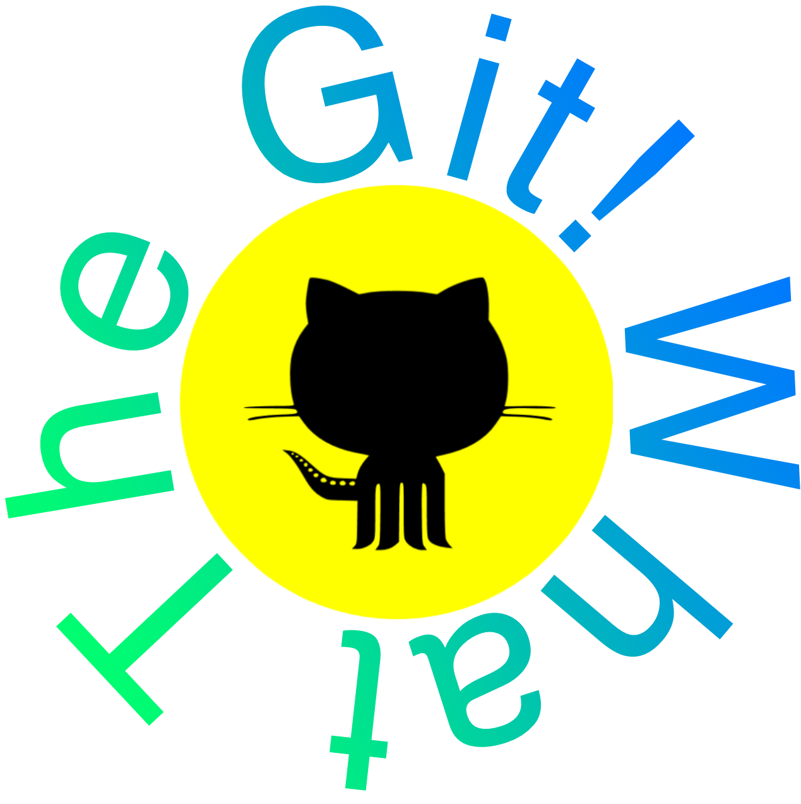

[![MIT License][license-shield]][license-url]

<div align="center">
  

  # What The Git!
  #### The Only Git Basics Education Tool That You Will Ever Need!
</div>

<!-- TABLE OF CONTENTS -->
<details id="table_of_contents">
  <summary>Table of Contents</summary>

- [About The Project](#about-the-projec)
    - [Built With](#built-with)
  - [Getting Started](#getting-started)
  - [UI](#ui)
  - [Roadmap](#roadmap)
  - [License](#license)
  - [Contact](#contact)
  - [Acknowledgments](#acknowledgments)

</details>


<!-- ABOUT THE PROJECT -->
## About The Project

<div align="center">
  <br>
  
  <br>
 </div>
 
What The Git! is a simple Git education tool that teaches users the basics of git via an interactive medium. Users will be able to go through various chapters or levels that teaches the user how to perform git-related tasks. Users can then execute git commands either by clicking the respective cards that execute a certain git command or by directly typing in commands to a simulated command line interface. Users will also have the ability to modify text files for the purposes of the game. As the user progresses through a chapter, the various commits and branches are visualized to ensure better understanding.

### Built With 
- [](https://www.python.org/downloads/release/python-360/)
- PyQt5

<!-- GETTING STARTED -->

## Getting Started
### Prerequsite

[](https://www.python.org/downloads/release/python-360/)

### Setup
1) Change to the project directory
```
cd edu-tool-group-project-thicc-juice
```

2) Create a virtual environment and activate
```
python3 -m venv venv
source venv/bin/activate (macOS)
venv\Scripts\activate (Windows)
```

3) Install all the dependencies
```
pip install -r requirements.txt
```

3) Change to src/ directory
```
cd src
```

5) Run!
```
./wtg_run.py
```

## UI
<div>
  
  
  
  
</div>

<!-- Roadmap -->
## Roadmap
### Sprint 1
* [x] Designed and implemented Start Screen
* [x] Designed and implemented Chapter Selection Screen
* [x] Designed and implemented Chapter Screen
* [x] Implemented card drag and drop
* [x] Implemented game soundtrack

### Sprint 2
* [x] Added music toggling in chapter selection and chapter screen
* [x] Implemented switching between start, chapter selection, and chapter screens
* [x] Implemented Command Line output based on user's interaction with the cards
* [x] Developed logic for git commands
* [x] Added ability for users to edit text file and automatically save the changes in a real text file outside
* [x] Updated UI for Main Menu and Chapter 1
* [x] All buttons are operatable and functionable to use
* [x] Change of colors to the cards and added text for instructions

### Sprint 3
* [x] Added ability for users to use Command line input
* [x] Implemented a core common logic that manages and tracks changes in git repo
* [x] Chapter 1 is now able to detect file modifications and react accordingly
* [x] Command line input detects up and down key events to allow the user to browse through command history
* [x] Added chapter 2 that challenges users to reach a specific commit state using git commands
* [x] Added a "Drag Card Here" label so the user knows where to drag the cards
* [x] Chapter 2 updates to UI: card setup, command line input/output, and creating a tree branch
* [x] Command line can detect an invlaid move or error
* [x] Implemented states and images to them
* [x] Allow user to use the up/down keys
* [x] Cards are put into synchronous order

<!-- LICENSE -->
## License

Distributed under the MIT License. See `LICENSE.txt` for more information.

<!-- Contact -->
## Contact

Bikram Chatterjee - b_chatterjee@u.pacific.edu

Hung Le - h_le21@u.pacific.edu 

Vincent Tran - v_tran37@u.pacific.edu

Benjamin Vu - b_vu6@u.pacific.edu


<!-- Acknowledgments -->
## Acknowledgments

* [Guide to Python’s Virtual Environments](https://towardsdatascience.com/virtual-environments-104c62d48c54)
* [Choosing an Open Source License](https://choosealicense.com)
* [Img Shields](https://shields.io)
* [Installing PyQT5 Designer For Mac](https://www.youtube.com/watch?v=eR9dNRvcseU)
* [Installing PyQt5 on a M1 Mac](https://stackoverflow.com/questions/65901162/how-can-i-run-pyqt5-on-my-mac-with-m1chip)
* [Inspired by Oh My Git!](https://ohmygit.org)
* [Managing Multiple Python Versions With pyenv](https://realpython.com/intro-to-pyenv/)
* [Pixelmator for Designing Graphics & Logos](https://www.pixelmator.com/pro/)
* [PyEnv BUILD FAILED installing Python on macOS](https://stackoverflow.com/questions/51551557/pyenv-build-failed-installing-python-on-macos/58712552#58712552)
* [PyQt5 Tutorial (Code)](https://www.youtube.com/watch?v=rZcdhles6vQ)
* [PyQt5 Tutorial - How to Use Qt Designer](https://www.youtube.com/watch?v=FVpho_UiDAY)
* [Python](https://www.python.org/)
* [The right and wrong way to set Python 3 as default on a Mac](https://opensource.com/article/19/5/python-3-default-mac)
* [.gitignore for venv](https://stackoverflow.com/questions/42306410/gitignore-syntax-how-to-exclude-virtualenv-sub-directories)
* [virtualenv](https://virtualenv.pypa.io/en/latest/#using-virtualenv-without-bin-python)

<div align="center">
    <br><br>
    Made with ❤️ by thicc-juice 🧃
</div>

[logo_wtg]: media/logo.png
[contributors-shield]: https://img.shields.io/github/contributors/othneildrew/Best-README-Template.svg?style=for-the-badge
[contributors-url]: https://github.com/comp129/edu-tool-group-project-thicc-juice/graphs/contributors
[license-shield]: https://img.shields.io/github/license/othneildrew/Best-README-Template.svg?style=for-the-badge
[license-url]: https://github.com/comp129/edu-tool-group-project-thicc-juice/blob/master/LICENSE
[issues-shield]: https://img.shields.io/github/issues/i0nics/super-mario-run.svg?style=for-the-badge
[issues-url]: https://github.com/i0nics/edu-tool-group-project-thicc-juice/issues
